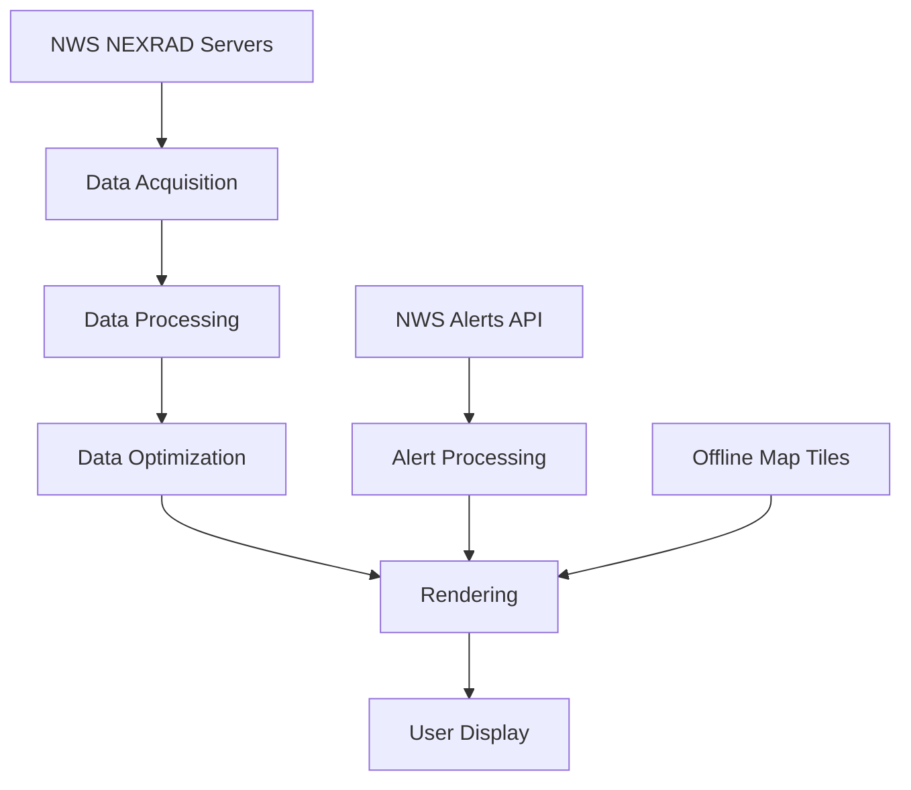

# TheClearWeather | NextGenRadar - Technical Overview

## Architecture Overview

TheClearWeather | NextGenRadar is a comprehensive radar visualization application designed to provide users with detailed weather radar data from the National Weather Service's NEXRAD network. The application consists of several core components:

### Core Components

1. **Data Acquisition Layer**
   - `NexradService`: Responsible for fetching real-time radar data from NWS servers
   - `RadarDataProcessor`: Handles the parsing and processing of Level 2 and Level 3 radar data products

2. **Data Visualization Layer**
   - `MapService`: Manages the rendering of radar data onto maps
   - `MapTileProvider`: Provides offline map tiles for the base map
   - `OfflineMapProvider`: Handles the integration of offline map data with radar overlays

3. **User Interface Layer**
   - Windows Forms-based UI for enhanced native performance on Windows systems
   - Controls for selecting radar stations, products, and display options

4. **Alert and Warning System**
   - `WarningsHelper`: Processes NWS weather alerts and warnings
   - Color-coded visualization according to official NWS standards

## Data Processing Pipeline

### Level 2 Data Processing

The NEXRAD Level 2 data processing pipeline involves the following steps:

1. **Data Acquisition**: The application connects directly to the NWS servers as specified in the nextgenradar.txt configuration file to fetch the latest radar data.

2. **Binary Data Processing**: The binary data is parsed and processed to extract the radar gate values. This process involves:
   - Extracting header information
   - Decoding radar moment data (reflectivity, velocity, spectrum width)
   - Converting raw values to meteorological units

3. **Spatial Transformation**: The polar radar data is mapped to geographic coordinates for visualization.

4. **Optimization**: For nationwide views, the system:
   - Uses spatial indexing to efficiently manage multiple radar datasets
   - Implements intelligent data culling to eliminate redundant or less relevant data points
   - Applies level-of-detail techniques for smooth zooming and panning

5. **Overlap Management**: Where radar coverage from multiple stations overlaps, the system:
   - Implements a priority algorithm based on data quality and proximity
   - Uses compositing techniques to create seamless visualizations
   - Preserves full data fidelity when viewing individual stations

### Level 3 Data Processing

For Level 3 products, the application:

1. Retrieves product-specific data files
2. Applies appropriate decoding algorithms for each product type
3. Implements specialized rendering techniques based on the product characteristics
4. Provides product-specific legends and information panels

## Rendering System

The rendering system employs several techniques to ensure high performance:

1. **Hardware Acceleration**: Leverages GPU acceleration where available
2. **Intelligent Caching**: Implements multi-level caching to reduce data processing overhead
3. **Progressive Loading**: Prioritizes visible data for immediate display
4. **Asynchronous Processing**: Background processing of data to maintain UI responsiveness

## Map Integration

All map resources are integrated directly into the application to eliminate external dependencies:

1. **Offline Map Tiles**: Pre-rendered map tiles at multiple zoom levels are embedded in the application
2. **Multiple Map Types**: Street, satellite, terrain, and dark mode maps are included
3. **Custom Styling**: Maps are styled specifically for optimal radar data visualization

## Alert System

Weather alerts are processed with the following workflow:

1. **Data Acquisition**: Alerts are retrieved from the NWS API
2. **Classification**: Alerts are categorized by type (watches, warnings, etc.)
3. **Geographic Mapping**: Alert boundaries are mapped to geographic coordinates
4. **Visual Styling**: Alerts are rendered with official NWS color coding
5. **Filtering System**: Users can toggle different alert categories for customized display

## Performance Optimizations

Several techniques are employed to ensure smooth performance:

1. **Delayed Loading**: Nationwide radar view is not auto-loaded to prevent initial performance impact
2. **Asynchronous Processing**: All intense data processing occurs in background threads
3. **Spatial Indexing**: Efficient data structures for quick geographic lookups
4. **Data Pruning**: Reduction of unnecessary data points while preserving meteorological significance
5. **Memory Management**: Intelligent caching and disposal of processed data

## UI Customization Framework

The application provides extensive UI customization capabilities:

1. **Nebula Sans Font Integration**: Custom font embedding for consistent branding
2. **Theme Support**: Light and dark mode with appropriate color palettes
3. **Layout Customization**: Adjustable panels and controls
4. **Opacity Controls**: Independent opacity settings for each data layer
5. **Side-by-Side Comparison**: Dual view mode for comparing different products or times

## Integration Points

The system is designed with several integration points for extensibility:

1. **Data Sources**: Pluggable data source architecture for potential future data providers
2. **Rendering Engines**: Support for alternative rendering engines
3. **Product Processors**: Framework for adding new radar product types
4. **Export Capabilities**: Data export interfaces for integration with other systems
